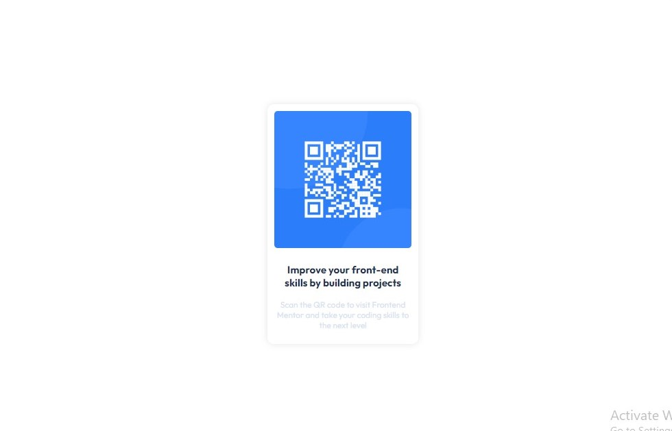

# Frontend Mentor - QR code component solution

This is a solution to the [QR code component challenge on Frontend Mentor](https://www.frontendmentor.io/challenges/qr-code-component-iux_sIO_H). Frontend Mentor challenges help you improve your coding skills by building realistic projects. 

## Table of contents

- [Overview](#overview)
  - [Screenshot](#screenshot)
  - [Links](#links)
- [My process](#my-process)
  - [Built with](#built-with)
  - [Continued development](#continued-development)
  - [Useful resources](#useful-resources)
- [Author](#author)

## Overview
[Overview]
A QR code component built with HTML and CSS, as part of the Frontend Mentor challenge.
[Features]
-Displays a QR code image
-Responsive design
-Built with HTML and CSS

### Screenshot

### Links

- Solution URL: (https://github.com/Ktuffuor/qr_code_component/tree/0f6c5a56d8c9701fca4bad22468c11b17c2199c4/qr-code-component-main)

## My process

### Built with

- Semantic HTML5 markup
- CSS custom properties
- Flexbox

### Continued development

"In my upcoming projects, I am dedicated to creating web pages that are highly responsive and adaptable to various devices and screen sizes, ensuring an optimal user experience across different platforms.

### Useful resources

- (https://www.w3schools.com) - The Flexible Box Layout Module, made it easier to design flexible responsive layout structure without using float or positioning.I really liked how easy it was to implement and will use it going forward.

## Author

- Frontend Mentor - (https://www.frontendmentor.io/profile/Ktuffuor)
- Twitter - (https://www.twitter.com/ktuffuor8)
